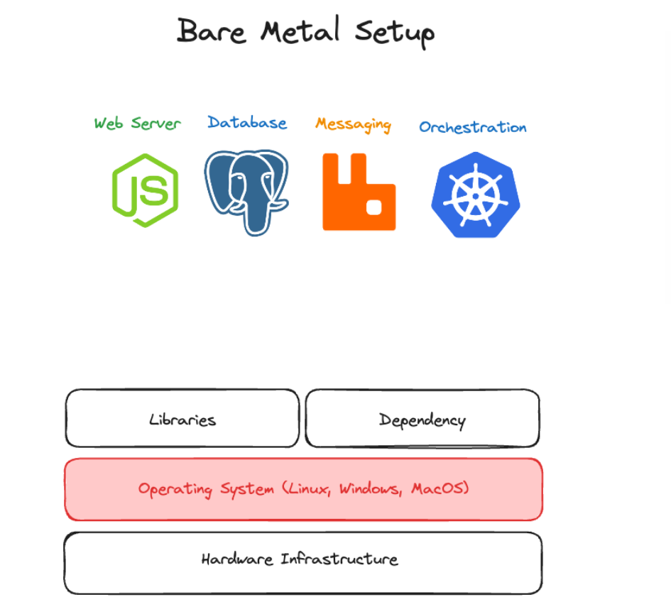
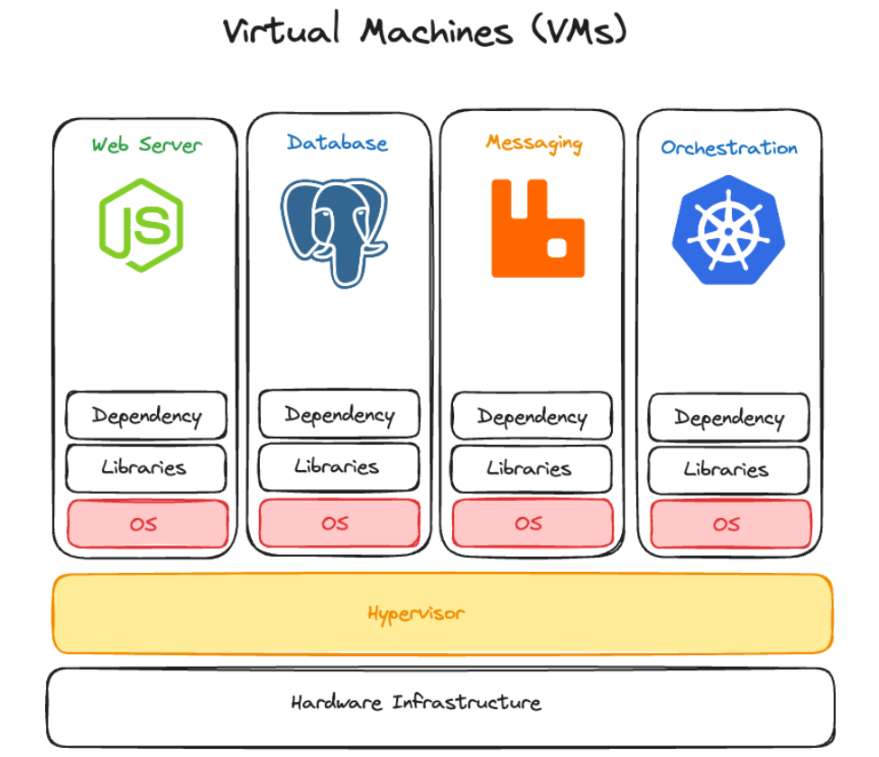
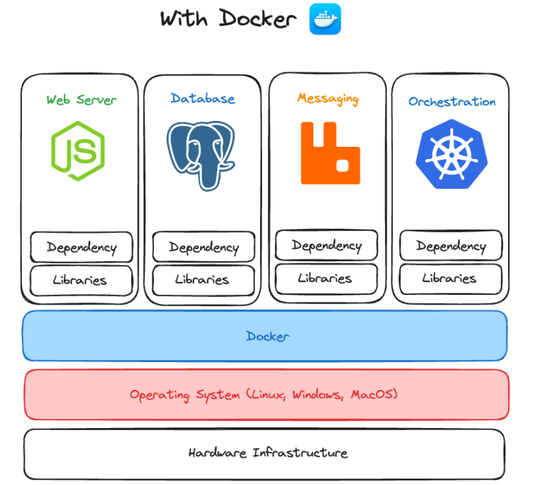
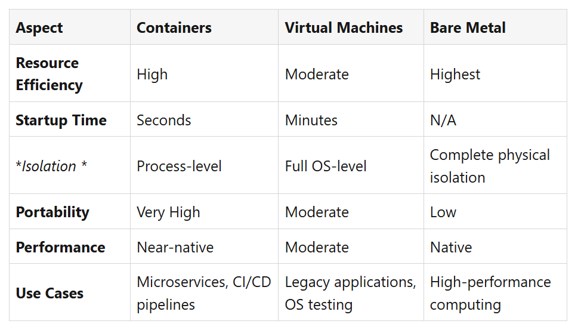
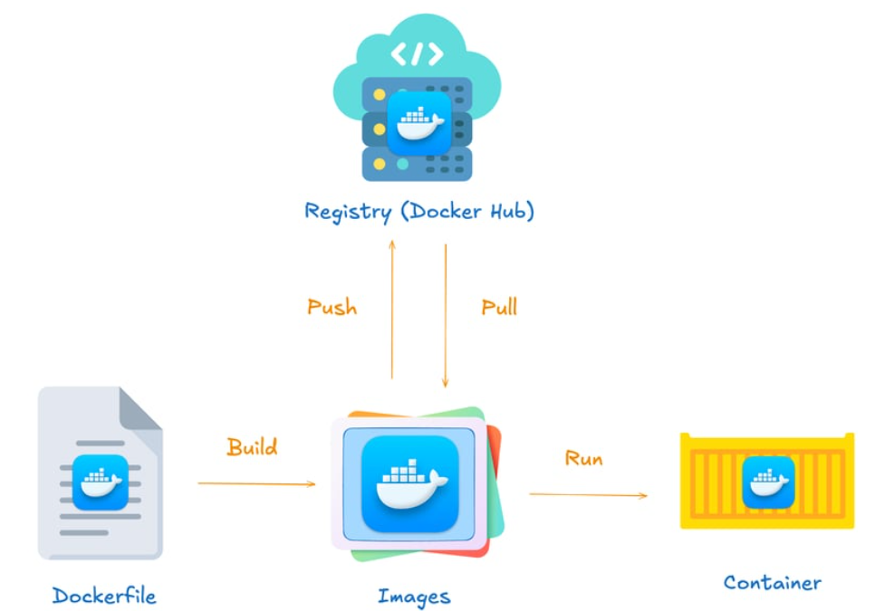
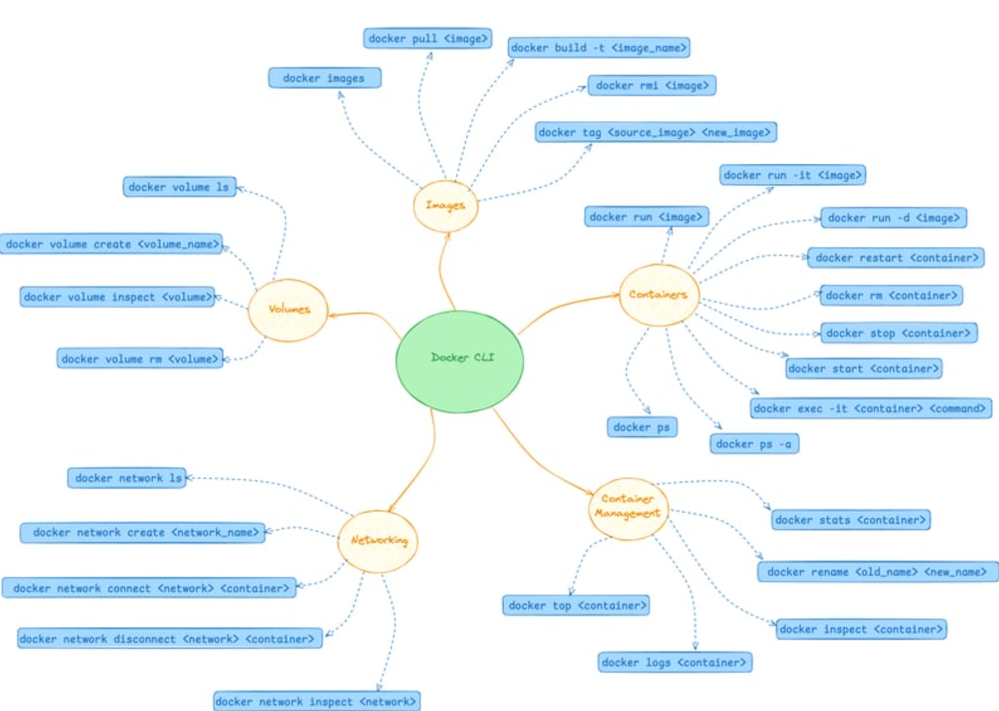
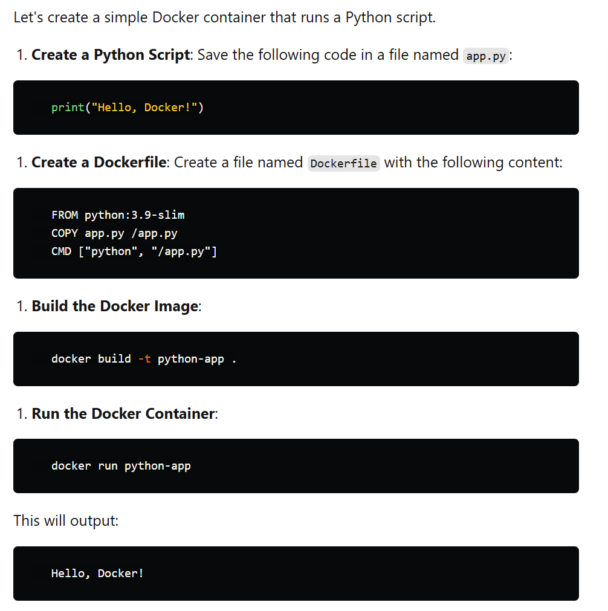

# Docker Core Concepts

Docker is like a magic toolbox for developers. It lets them build, ship, and manage their apps in tiny, portable boxes called containers. Containers are like virtual rooms, but they are way faster and more efficient than traditional virtual machines (VMs). Thanks to Docker, containers have become super popular, and they’re now a must-have part of modern software development.

## What is Docker?

Docker is an open-source platform that automates the deployment of applications inside containers. Containers are isolated environments that contain everything needed to run an application, including the code, runtime, libraries, and system tools. Docker provides developers with tools to build, manage, and distribute these containers.

## What is the Open Container Initiative (OCI)?

The Open Container Initiative (OCI) is an open governance structure established in 2015 by the Linux Foundation. It aims to create industry standards for container runtime and image specifications, ensuring interoperability across container ecosystems.

Docker originally developed its own container runtime and image formats. However, the rise of containers and the need for broader standardization led Docker to contribute its container runtime technology, runc, to the OCI. Today, Docker’s ecosystem adheres to OCI standards, making Docker containers compatible with other OCI-compliant runtimes and tools.

By aligning with OCI standards, Docker ensures that its containers and images can run across various platforms and tools, fostering a more open and collaborative container ecosystem.

## Why are Containers Useful?

* Portability: Containers can run on any system that supports OCI-compliant runtimes, ensuring that applications behave consistently across environments.
* Efficiency: Containers share the host system's kernel, making them lightweight and fast to start compared to VMs.
* Scalability: Containers can be easily scaled up or down to handle varying loads.
* Consistency: Containers reduce the "it works on my machine" problem by encapsulating all dependencies and configurations.

### Bare Metal:

* Runs directly on physical hardware without any virtualization.
* Offers maximum performance and direct access to hardware resources.
* Best suited for high-performance workloads and applications that require complete control over hardware.

### Virtual Machines (VMs):

* Include a full OS, making them heavier.
* Require more resources and take longer to start.
* Suitable for running multiple OS environments on a single physical machine.

### Containers:

* Share the host OS kernel, making them lightweight.
* Use less memory and start quickly.
* Ideal for microservices and rapid deployments.

## Docker Terminology

* **Dockerfile**: A text file with instructions for building a Docker image.
* **Image**: A read-only template used to create containers. Images are built from a Dockerfile and follow OCI image specifications.
* **Container**: A runnable instance of an image. Containers can be started, stopped, and deleted.
* **Registry**: A repository for Docker images. Docker Hub is a popular public registry, and other OCI-compliant registries include Harbor and Quay.

### Docker Command Line Cheat Sheet

0. Basic Docker Commands
docker --version: Check Docker version.
docker help: Show Docker commands and options.
docker info: Display system-wide information about Docker.

**1. Images**
* docker images: List all local images.
* docker pull <image>: Download an image from Docker Hub.
* docker build -t <image_name> .: Build an image from a Dockerfile in the current directory.
* docker rmi <image>: Remove an image.
* docker tag <source_image> <new_image>: Tag an image with a new name.

**2. Containers**
* docker run <image>: Run a container from an image.
* docker run -it <image>: Run a container in interactive mode.
* docker run -d <image>: Run a container in detached mode.
* docker ps: List running containers.
* docker ps -a: List all containers (including stopped ones).
* docker stop <container>: Stop a running container.
* docker start <container>: Start a stopped container.
* docker restart <container>: Restart a container.
* docker rm <container>: Remove a stopped container.
* docker exec -it <container> <command>: Run a command inside a running container.

**3. Container Management**
* docker logs <container>: View logs of a container.
* docker top <container>: Display the processes running in a container.
* docker stats <container>: Display a live stream of resource usage statistics.
* docker inspect <container>: View details about a container or image.
* docker rename <old_name> <new_name>: Rename a container.

**4. Networking**
* docker network ls: List all Docker networks.
* docker network create <network_name>: Create a new network.
* docker network connect <network> <container>: Connect a container to a network.
* docker network disconnect <network> <container>: Disconnect a container from a network.
* docker network inspect <network>: View details about a network.

**5. Volumes**
* docker volume ls: List all volumes.
* docker volume create <volume_name>: Create a volume.
* docker volume inspect <volume>: Display detailed information about a volume.
* docker volume rm <volume>: Remove a volume.

### Example: Creating a Simple Docker Container

