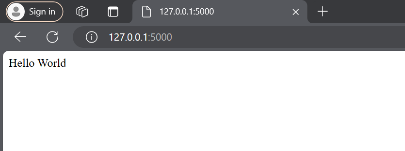
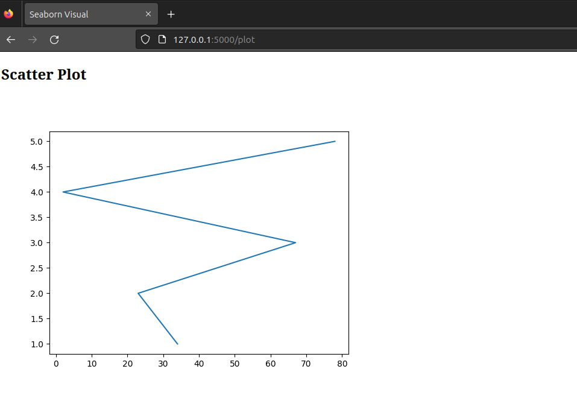
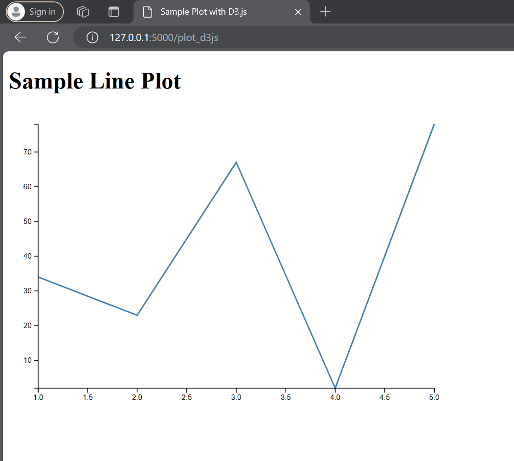
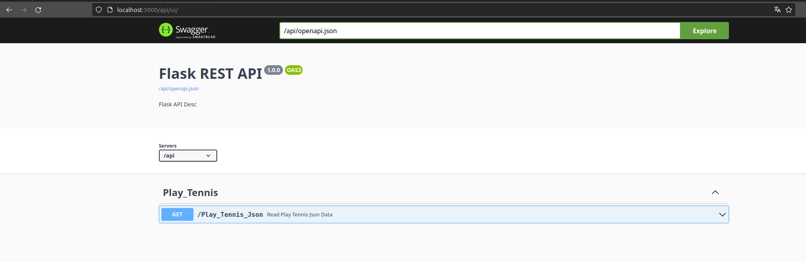
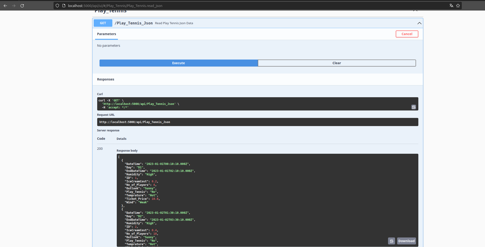

## Flask API Endpoints Examples

### Run Flask App

```python
(adv_python_env) ~/PythonCodeHub/FlaskApps/Scripts$ python EDA_Viz.py
`ConnexionMiddleware.run` is optimized for development. For production, run using a dedicated ASGI server.
INFO:     Started server process [13011]
INFO:     Waiting for application startup.
INFO:     Application startup complete.
INFO:     Uvicorn running on http://0.0.0.0:5000 (Press CTRL+C to quit)

```

### Message - As Response

<!--  -->


### Message - As Render HTML Response


### Plot[`Seaborn`] - As Render HTML Response



### Plot[`D3js`] - As Render HTML Response



### Swagger Documment



