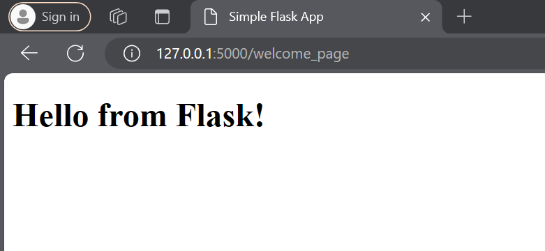
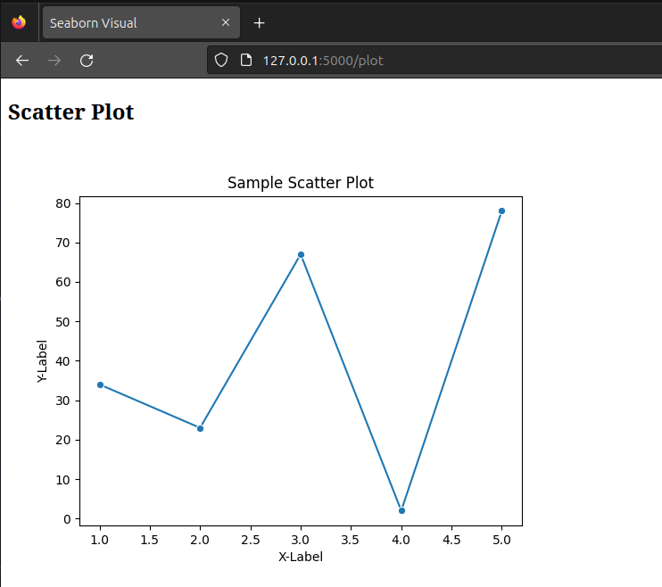

## Flask API Endpoints Examples

### Run Flask App

```python
(adv_python_env) ~/PythonCodeHub/FlaskApps/Scripts$ python EDA_Viz.py 
 * Serving Flask app 'Seaborn_EDA_Viz'
 * Debug mode: off
WARNING: This is a development server. Do not use it in a production deployment. Use a production WSGI server instead.
 * Running on all addresses (0.0.0.0)
 * Running on http://127.0.0.1:5000

```

### Message - As Response


### Message - As Render HTML Response


### Plot[`Seaborn`] - As Render HTML Response


### Plot[`D3js`] - As Render HTML Response
