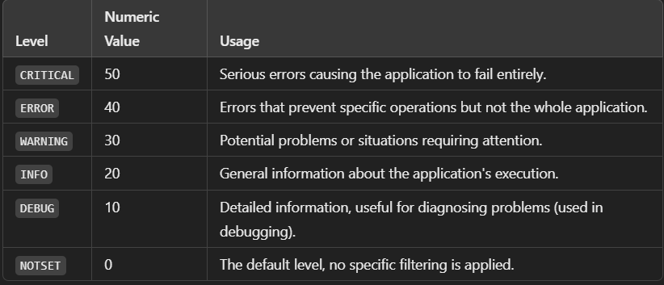

## Logging

### Logging Best Practices:

Use the logging Module:

* Avoid using print for debugging or status messages. Use Python's built-in logging module for better flexibility and control.

* Set Appropriate Logging Levels:
    * Use levels (DEBUG, INFO, WARNING, ERROR, CRITICAL) to categorize log messages:
        * DEBUG: Detailed information for debugging.
        * INFO: General operational messages.
        * WARNING: Non-critical issues or warnings.
        * ERROR: Errors that cause the operation to fail.
        * CRITICAL: Severe errors or failures.

* Write to Log Files:
    * Save logs to a file for persistence and later analysis.

* Add Context to Logs:
    * Include relevant details (e.g., timestamps, job IDs, etc.) to make logs informative.

* Integrate with Centralized Logging:
    * After writing to local log files, consider shipping logs to centralized tools like **`Elasticsearch`**, **`Logstash`**, **`Grafana Loki`**, or Kibana (**`ELK Stack`**) for monitoring and analytics.



```py
logging.debug("This is a debug message.")       # Level 10
logging.info("This is an info message.")        # Level 20
logging.warning("This is a warning message.")   # Level 30
logging.error("This is an error message.")      # Level 40
logging.critical("This is a critical message.") # Level 50
```

> **Note**: Filtering if level=logging.WARNING, only WARNING, ERROR, and CRITICAL messages will appear.

### Execution

- Logging to file
```py
logging.basicConfig(
    filename="info.log",
    filemode="a",
    level=logging.DEBUG, # Set logging level
    format = "%(asctime)s - %(name)s - %(levelname)s - %(message)s"
)
```

```sh
(pythoncodehub-py3.11) rga@rgavm:/mnt/Local/Git_Repo/PythonCodeHub/Logging$ python main.py 
(pythoncodehub-py3.11) rga@rgavm:/mnt/Local/Git_Repo/PythonCodeHub/Logging$ cat info.log 
2025-01-26 18:30:09,105 - root - INFO - Started root code execution!
2025-01-26 18:30:09,106 - a - ERROR - Error raised
2025-01-26 18:30:09,108 - a - ERROR - division by zero
```

- Logging to console
```py
logging.basicConfig(
    # filename="info.log",
    # filemode="a",
    level=logging.DEBUG, # Set logging level
    format = "%(asctime)s - %(name)s - %(levelname)s - %(message)s"
)
```

```sh
(pythoncodehub-py3.11) rga@rgavm:/mnt/Local/Git_Repo/PythonCodeHub/Logging$ python main.py 
2025-01-26 18:33:14,387 - root - INFO - Started root code execution!
2025-01-26 18:33:14,388 - a - ERROR - Error raised
2025-01-26 18:33:14,388 - a - ERROR - division by zero

```
