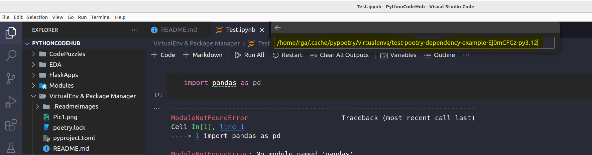

### How to install Pyenv [Ubuntu]

**Install Pyenv**

>Various Python Versions creator and can also create virtual environment but we need manual create requirements.txt for dependencies and install using pip, but Poetry can do both virtual environment creation and dependency installation per project in more sophisticated way.

```sh
$ python3 --version
Python 3.10.12
$ sudo apt-get update && sudo apt-get install make build-essential libssl-dev \
    zlib1g-dev libbz2-dev libreadline-dev libsqlite3-dev wget curl llvm \
    libncursesw5-dev xz-utils tk-dev libxml2-dev libxmlsec1-dev libffi-dev liblzma-dev
$ curl https://pyenv.run | bash
$ export PYENV_ROOT="$HOME/.pyenv"
[[ -d $PYENV_ROOT/bin ]] && export PATH="$PYENV_ROOT/bin:$PATH"
eval "$(pyenv init -)"
$ eval "$(pyenv virtualenv-init -)"
$ source ~/.bashrc

$ pyenv --version
#pyenv 2.4.17

$ pyenv install 3.12
#Downloading Python-3.12.7.tar.xz...
#-> https://www.python.org/ftp/python/3.12.7/Python-3.12.7.tar.xz
#Installing Python-3.12.7...
#Installed Python-3.12.7 to /home/rga/.pyenv/versions/3.12.7
$ pyenv install 3.11
#Downloading Python-3.11.10.tar.xz...
#-> https://www.python.org/ftp/python/3.11.10/Python-3.11.10.tar.xz
#Installing Python-3.11.10...
#Installed Python-3.11.10 to /home/rga/.pyenv/versions/3.11.10

#pyenv shell <version>  — select just for current shell session
#pyenv local <version>  — automatically select whenever you are in the current directory (or its subdirectories)
#pyenv global <version>  — select globally for your user account

$ pyenv versions
* system (set by /home/rga/.pyenv/version)
  3.11.10
  3.12.7

$ pyenv global 3.11
$ python --version
Python 3.11.10

$ pyenv global 3.12
$ python --version
Python 3.12.7
```

### How to install Poetry [Ubuntu]

>Virtual Environment Creator within Pyenv Python Version and Dependency Manager per Project

**Install Poetry**
```sh
$ curl -sSL https://install.python-poetry.org | python3 -

# Manual Step Need to do Everytime #
####################################
$ export PATH="/home/rga/.local/bin:$PATH"

$ poetry --version
#Poetry (version 1.8.4)

# Adding to Bash for avoiding doing it again and again #
########################################################
$ nano ~/.bashrc
# Add below line at the end, then --> ctrl + x --> y --> enter
export PATH="/home/rga/.local/bin:$PATH"
$ source ~/.bashrc

$ poetry --version
#Poetry (version 1.8.4)
```

**Initialise Project: Step 1**
```sh
rga@local-vm:/mnt/Local/Git_Repo/PythonCodeHub/VirtualEnv & Package Manager$ ls -l
total 1
-rwxrwxrwx 1 root root 79 Nov 17 11:15 README.md

rga@local-vm:/mnt/Local/Git_Repo/PythonCodeHub/VirtualEnv & Package Manager$ poetry init

This command will guide you through creating your pyproject.toml config.

Package name [virtualenv & package manager]:  test_poetry_dependency_example
Version [0.1.0]:  0.1.0
Description []:  Poetry Example
Author [None, n to skip]:  
normalize() argument 2 must be str, not None
Author [None, n to skip]:  Rakesh
License []:  None
Compatible Python versions [^3.12]:  

Would you like to define your main dependencies interactively? (yes/no) [yes] yes
You can specify a package in the following forms:
  - A single name (requests): this will search for matches on PyPI
  - A name and a constraint (requests@^2.23.0)
  - A git url (git+https://github.com/python-poetry/poetry.git)
  - A git url with a revision (git+https://github.com/python-poetry/poetry.git#develop)
  - A file path (../my-package/my-package.whl)
  - A directory (../my-package/)
  - A url (https://example.com/packages/my-package-0.1.0.tar.gz)

Package to add or search for (leave blank to skip): 

Would you like to define your development dependencies interactively? (yes/no) [yes] yes
Package to add or search for (leave blank to skip): 

Generated file

[tool.poetry]
name = "test-poetry-dependency-example"
version = "0.1.0"
description = "Poetry Example"
authors = ["Rakesh"]
license = "None"
readme = "README.md"

[tool.poetry.dependencies]
python = "^3.12"


[build-system]
requires = ["poetry-core"]
build-backend = "poetry.core.masonry.api"


Do you confirm generation? (yes/no) [yes] yes

rga@local-vm:/mnt/Local/Git_Repo/PythonCodeHub/VirtualEnv & Package Manager$ ls -l
total 1
-rwxrwxrwx 1 root root 293 Nov 17 12:51 pyproject.toml
-rwxrwxrwx 1 root root 324 Nov 17 11:25 README.md
```

**Initialise Project: Step 2**
```sh
rga@local-vm:/mnt/Local/Git_Repo/PythonCodeHub/VirtualEnv & Package Manager$ python --version
Python 3.12.7

rga@local-vm:/mnt/Local/Git_Repo/PythonCodeHub/VirtualEnv & Package Manager$ pyenv versions
  system
  3.11.10
* 3.12.7 (set by /home/rga/.pyenv/version)

rga@local-vm:/mnt/Local/Git_Repo/PythonCodeHub/VirtualEnv & Package Manager$ poetry env use $(pyenv which python)
Creating virtualenv test-poetry-dependency-example-Ej0mCFGz-py3.12 in /home/rga/.cache/pypoetry/virtualenvs
Using virtualenv: /home/rga/.cache/pypoetry/virtualenvs/test-poetry-dependency-example-Ej0mCFGz-py3.12
```

**Adding Dependencies[Specific for Project]**

Installing python libraries

```sh
rga@local-vm:/mnt/Local/Git_Repo/PythonCodeHub/VirtualEnv & Package Manager$ ls -l
total 4
-rwxrwxrwx 1 root root  293 Nov 17 12:51 pyproject.toml
-rwxrwxrwx 1 root root 2719 Nov 17 12:54 README.md

rga@local-vm:/mnt/Local/Git_Repo/PythonCodeHub/VirtualEnv & Package Manager$ poetry add pandas ipython ipykernel
Using version ^2.2.3 for pandas
Using version ^8.29.0 for ipython
Using version ^6.29.5 for ipykernel

Updating dependencies
Resolving dependencies... (1.4s)

Package operations: 6 installs, 0 updates, 0 removals

  - Installing six (1.16.0)
  - Installing numpy (2.1.3)
  - Installing python-dateutil (2.9.0.post0)
  - Installing pytz (2024.2)
  - Installing tzdata (2024.2)
  - Installing pandas (2.2.3)
  - Installing asttokens (2.4.1)
  - Installing executing (2.1.0)
  - Installing parso (0.8.4)
  - Installing platformdirs (4.3.6)
  - Installing ptyprocess (0.7.0)
  - Installing pure-eval (0.2.3)
  - Installing traitlets (5.14.3)
  - Installing wcwidth (0.2.13)
  - Installing decorator (5.1.1)
  - Installing jedi (0.19.2)
  - Installing jupyter-core (5.7.2)
  - Installing matplotlib-inline (0.1.7)
  - Installing pexpect (4.9.0)
  - Installing prompt-toolkit (3.0.48)
  - Installing pygments (2.18.0)
  - Installing pyzmq (26.2.0)
  - Installing stack-data (0.6.3)
  - Installing tornado (6.4.1)
  - Installing comm (0.2.2)
  - Installing debugpy (1.8.8)
  - Installing ipython (8.29.0)
  - Installing jupyter-client (8.6.3)
  - Installing nest-asyncio (1.6.0)
  - Installing packaging (24.2)
  - Installing psutil (6.1.0)
  - Installing ipykernel (6.29.5)

Writing lock file

rga@local-vm:/mnt/Local/Git_Repo/PythonCodeHub/VirtualEnv & Package Manager$ ls -l
total 23
-rwxrwxrwx 1 root root 19174 Nov 17 12:56 poetry.lock
-rwxrwxrwx 1 root root   311 Nov 17 12:56 pyproject.toml
-rwxrwxrwx 1 root root  2719 Nov 17 12:54 README.md
```

**Activating Virtual Environment using Poetry**

```sh
rga@local-vm:/mnt/Local/Git_Repo/PythonCodeHub/VirtualEnv & Package Manager$ poetry shell
Spawning shell within /home/rga/.cache/pypoetry/virtualenvs/test-poetry-dependency-example-Ej0mCFGz-py3.12
. /home/rga/.cache/pypoetry/virtualenvs/test-poetry-dependency-example-Ej0mCFGz-py3.12/bin/activate

rga@local-vm:/mnt/Local/Git_Repo/PythonCodeHub/VirtualEnv & Package Manager$ . /home/rga/.cache/pypoetry/virtualenvs/test-poetry-dependency-example-Ej0mCFGz-py3.12/bin/activate

(test-poetry-dependency-example-py3.12) rga@local-vm:/mnt/Local/Git_Repo/PythonCodeHub/VirtualEnv & Package Manager$ python
Python 3.12.7 (main, Nov 17 2024, 10:40:23) [GCC 11.4.0] on linux
Type "help", "copyright", "credits" or "license" for more information.
>>> import pandas
>>> df = pandas.DataFrame({"A":[1,2,3]})
>>> df
   A
0  1
1  2
2  3
>>>
```

**Deactivate Virtual Environment**

```sh
(test-poetry-dependency-example-py3.12) rga@local-vm:/mnt/Local/Git_Repo/PythonCodeHub/VirtualEnv & Package Manager$ deactivate

rga@local-vm:/mnt/Local/Git_Repo/PythonCodeHub/VirtualEnv & Package Manager$ 

```

**Run Python Application or Scripts**

```sh
python app.py
```

**Run Tests**

```sh
pytest
```

**Activate Poetry Virtual Env for VS Code execution**

- From above we can see how we can execute code in poetry virtual env. But now we want to execute code from VSCode.
- Install Jupyter in the Poetry Environment: Activate your Poetry virtual environment and install Jupyter:
```sh
poetry shell
poetry add jupyter

  - Installing attrs (24.2.0)
  - Installing rpds-py (0.21.0)
  - Installing referencing (0.35.1)
  - Installing jsonschema-specifications (2024.10.1)
  - Installing types-python-dateutil (2.9.0.20241003)
  - Installing arrow (1.3.0)
  - Installing fastjsonschema (2.20.0)
  - Installing jsonschema (4.23.0)
  - Installing pycparser (2.22)
  - Installing cffi (1.17.1)
  - Installing fqdn (1.5.1)
  - Installing idna (3.10)
  - Installing isoduration (20.11.0)
  - Installing jsonpointer (3.0.0)
  - Installing markupsafe (3.0.2)
  - Installing nbformat (5.10.4)
  - Installing rfc3339-validator (0.1.4)
  - Installing rfc3986-validator (0.1.1)
  - Installing soupsieve (2.6)
  - Installing uri-template (1.3.0)
  - Installing webcolors (24.11.1)
  - Installing webencodings (0.5.1)
  - Installing argon2-cffi-bindings (21.2.0)
  - Installing beautifulsoup4 (4.12.3)
  - Installing bleach (6.2.0)
  - Installing defusedxml (0.7.1)
  - Installing jinja2 (3.1.4)
  - Installing jupyterlab-pygments (0.3.0)
  - Installing mistune (3.0.2)
  - Installing nbclient (0.10.0)
  - Installing pandocfilters (1.5.1)
  - Installing python-json-logger (2.0.7)
  - Installing pyyaml (6.0.2)
  - Installing tinycss2 (1.4.0)
  - Installing terminado (0.18.1)
  - Installing sniffio (1.3.1)
  - Installing anyio (4.6.2.post1)
  - Installing argon2-cffi (23.1.0)
  - Installing certifi (2024.8.30)
  - Installing charset-normalizer (3.4.0)
  - Installing h11 (0.14.0)
  - Installing jupyter-events (0.10.0)
  - Installing jupyter-server-terminals (0.5.3)
  - Installing nbconvert (7.16.4)
  - Installing overrides (7.7.0)
  - Installing prometheus-client (0.21.0)
  - Installing send2trash (1.8.3)
  - Installing urllib3 (2.2.3)
  - Installing websocket-client (1.8.0)
  - Installing babel (2.16.0)
  - Installing httpcore (1.0.7)
  - Installing json5 (0.9.28)
  - Installing jupyter-server (2.14.2)
  - Installing requests (2.32.3)
  - Installing async-lru (2.0.4)
  - Installing httpx (0.27.2)
  - Installing jupyter-lsp (2.2.5)
  - Installing jupyterlab-server (2.27.3)
  - Installing notebook-shim (0.2.4)
  - Installing setuptools (75.5.0)
  - Installing jupyterlab (4.3.1)
  - Installing jupyterlab-widgets (3.0.13)
  - Installing widgetsnbextension (4.0.13)
  - Installing ipywidgets (8.1.5)
  - Installing jupyter-console (6.6.3)
  - Installing notebook (7.0.7)
  - Installing jupyter (1.1.1)
```
- Activate the Poetry Environment
  - Find the path to the Poetry environment:
````sh
$ poetry env info --path
#/home/rga/.cache/pypoetry/virtualenvs/test-poetry-dependency-example-Ej0mCFGz-py3.12
````
- Register the Poetry Environment as a Jupyter Kernel
```sh
$ poetry shell
#Virtual environment already activated: /home/rga/.cache/pypoetry/virtualenvs/test-poetry-dependency-example-Ej0mCFGz-py3.12
$ python -m ipykernel install --user --name=poetry_env --display-name "Python (Poetry)"

#rga@local-vm:/mnt/Local/Git_Repo/PythonCodeHub/VirtualEnv & Package Manager$ python -m ipykernel install --user --name=test-poetry-dependency-example-Ej0mCFGz-py3.12 --display-name "Python (Poetry)"
#Installed kernelspec test-poetry-dependency-example-Ej0mCFGz-py3.12 in /home/rga/.local/share/jupyter/kernels/test-poetry-dependency-example-ej0mcfgz-py3.12
```
- Find Poetry Virtual Env path in VScode Interpreter path 




- Restart VS


**Setting Up the Python Project on Another PC[Using Poetry: yproject.toml]**

`Step 1`: Install Poetry.
    - Ensure Poetry is installed on the new PC: check above steps

Verify Poetry installation:
```sh
poetry --version
```

`Step 2`: Clone or Copy the Project
    - Clone the repository or copy the project files to the new PC:
```sh
git clone https://github.com/your-repo/my_project.git
cd my_project
```

`Step 3`: If the project requires a specific Python version:
- Ensure pyenv is installed.
- Install the required Python version (as specified in pyproject.toml):
```sh
pyenv install 3.10.8
pyenv local/global 3.10.8
```

- Let Poetry use the pyenv-managed Python version:
```sh
poetry env use $(pyenv which python)
```

`Step 4`: Install Dependencies Using pyproject.toml
- Run the following command to install dependencies and set up a virtual environment:
```sh
poetry install
```
- This command:
    - Reads the pyproject.toml file.
    - Installs all the dependencies and dev dependencies specified.
    - Creates a virtual environment if one does not already exist.

`Step 5`: Activate the Virtual Environment
- Activate the virtual environment created by Poetry:
```sh
poetry shell
```

`Step 6`: Verify the Python version and installed packages:
```sh
python --version
poetry show
```